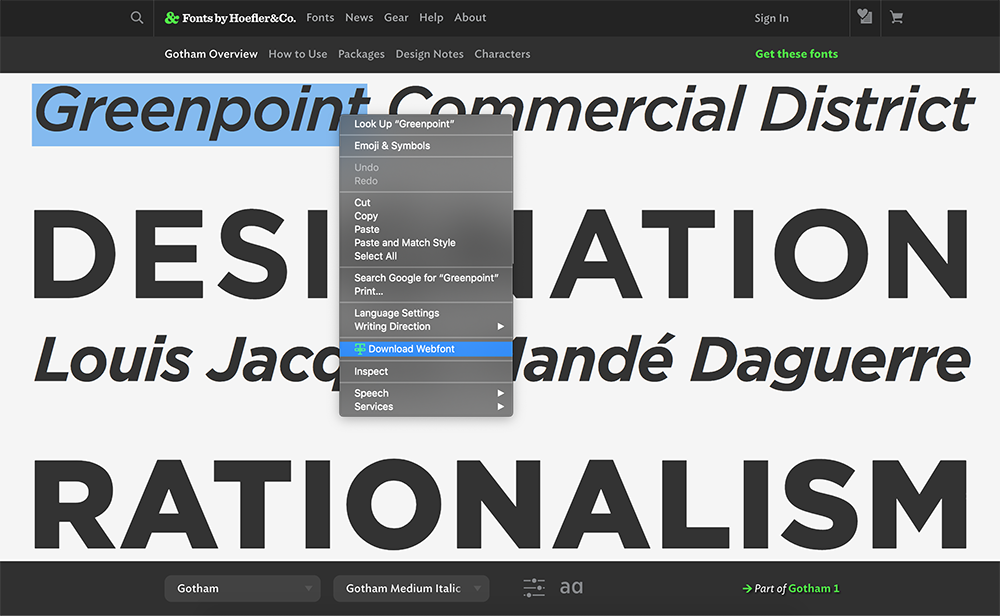
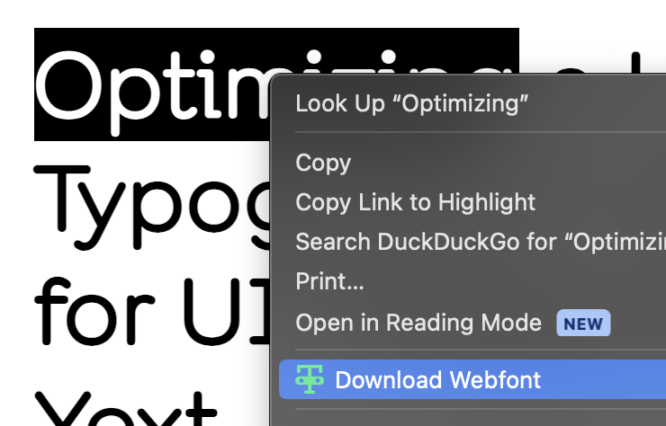

# Banditto
A Chrome extension that converts and saves webfonts to desktop.

## Setup

- Download this code from Github
- In Chrome, go to `chrome://extensions`
- Check the "Developer Mode" toggle in the top-right corner
- Click Load Unpacked
- Select the folder for this repository

## Usage

Right click on the element, then click "Download Webfont".

## To-Do
- Levenshtein sequence for font-family detection
- Conversion to TTF upon download.
- Some sites encode their fonts in base64, so a built-in decoder for that case.

## Known Bugs
- While loop doesn't break and destroys entire websites.
